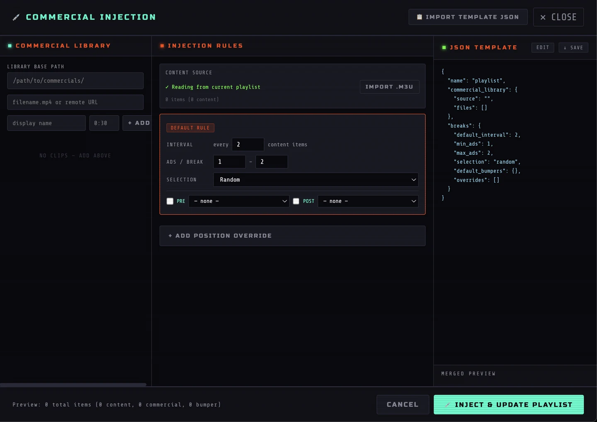

<div align="center">


# Drop Zone Ops

### Build broadcast-ready M3U playlists without touching a text editor.

A visual, client-side playlist operations tool for assembling local and remote media, organizing programming blocks, automating commercial breaks, and exporting clean M3U playlists for VLC, OBS, and compatible players.

[](#run-locally)
[](#privacy-and-security)
[](#m3u-output)
[](#playback-targets)

[Open the Builder](app.html) · [Read the Documentation](docs.html) · [View the Landing Page](index.html)

</div>

---

## What it does

Drop Zone Ops turns playlist construction into a visual workflow:

1. **Drop** local files and folders or add remote media URLs.
2. **Arrange** content into the exact order you want.
3. **Tag and group** entries as content, commercials, bumpers, interstitials, or custom blocks.
4. **Inject breaks** using reusable rules and commercial libraries.
5. **Export** a clean Extended M3U playlist ready for playback.

The project is designed for DIY broadcasting, archival channels, scheduled media playback, internet radio/TV experiments, live production support, and anyone who needs repeatable playlist assembly without editing M3U files manually.

---

## Why Drop Zone Ops

Most playlist tools either expose raw text, hide important path behavior, or assume a narrow media workflow. Drop Zone Ops keeps the process visible and controllable.

- No account
- No build step
- No backend
- No database
- No media upload
- No command-line requirement for normal use
- Local and remote media in the same playlist
- Drag-and-drop ordering
- Root-path handling for local files
- CSV and JSON import
- Commercial and bumper injection
- Human-readable M3U preview
- Reusable templates
- OBS and VLC-oriented export

---

## Interface

### Playlist Builder


Build, reorder, tag, group, rename, and inspect playlist entries in one visual workspace.

### Commercial Injection



Create a commercial library, define default break behavior, add position-specific overrides, assign pre/post bumpers, inspect the merged result, and update the active playlist.

---

## Run locally

Drop Zone Ops is a static browser application.

### Option 1 — open directly

Open:

```text
index.html
```

Then launch the builder from the landing page.

### Option 2 — use a local web server

Python:

```bash
python3 -m http.server 8000
```

Then open:

```text
http://localhost:8000
```

A local server is recommended when testing browser behavior across multiple pages and assets.

---

## Core workflow

```text
Local files / folders ─┐
                       ├─> Visual playlist ─> Tag + group ─> Break injection ─> M3U export
Remote media URLs ─────┘
```

### 1. Add media

- Drop individual media files
- Drop folders and preserve supported relative paths
- Browse for multiple local files
- Paste remote HTTP or HTTPS media URLs
- Import structured playlist data from CSV or JSON

### 2. Organize

- Drag rows into playback order
- Rename entries
- Edit file paths and URLs
- Add durations
- Apply content tags
- Assign groups or programming blocks
- Review playlist statistics and estimated runtime

### 3. Automate breaks

- Build a reusable commercial library
- Insert ads after a configurable number of content items
- Set minimum and maximum ads per break
- Choose random or sequential selection
- Add pre-break and post-break bumpers
- Create position-specific overrides
- Save and reload injection templates

### 4. Export

- Preview Extended M3U output
- Name the playlist
- Export a clean `.m3u` file
- Load the result into VLC or an OBS VLC Video Source

---

## Supported entry types

| Tag | Intended use |
|---|---|
| `content` | Shows, films, episodes, features, and main programming |
| `commercial` | Advertisements and sponsor spots |
| `bumper` | Station IDs, intros, outros, and break transitions |
| `interstitial` | Short filler and between-program material |
| `other` | Entries outside the primary categories |

---

## Import formats

### CSV

Accepted headers:

```csv
path,name,duration,tag,group
/Users/you/Videos/episode-01.mp4,Episode 01,22:30,content,block-1
https://media.example.com/ad.mp4,Soda Ad,0:30,commercial,ad-break-1
```

A starter file is included:

```text
playlist-template.csv
```

### JSON

```json
[
  {
    "path": "/Users/you/Videos/episode-01.mp4",
    "name": "Episode 01",
    "duration": "22:30",
    "tag": "content",
    "group": "block-1"
  },
  {
    "path": "https://media.example.com/ad.mp4",
    "name": "Soda Ad",
    "duration": "0:30",
    "tag": "commercial",
    "group": "ad-break-1"
  }
]
```

A starter file is included:

```text
playlist-template.json
```

---

## M3U output

Drop Zone Ops exports Extended M3U.

```m3u
#EXTM3U
#EXTINF:1350 group-title="block-1" tvg-type="content",Episode 01
/Users/you/Videos/episode-01.mp4
#EXTINF:30 group-title="ad-break-1" tvg-type="commercial",Soda Ad
https://media.example.com/ad.mp4
```

The exported metadata preserves:

- Display name
- Duration
- Content type
- Group or block
- Local path or remote URL

---

## Playback targets

### VLC

Open the exported `.m3u` file directly in VLC.

### OBS

1. Add a **VLC Video Source**.
2. Add the exported `.m3u` as a path or URL.
3. Confirm that every local path is valid on the OBS machine.
4. Refresh the source after replacing a playlist if OBS retains an older version.

---

## Local path handling

Browsers do not normally expose complete local filesystem paths for selected files.

Drop Zone Ops uses a **Root Folder Path** that you provide:

```text
macOS / Linux
/Users/you/Videos/content/

Windows
C:\Users\you\Videos\content\
```

Individual local filenames are combined with that root path. Remote URLs are left unchanged.

The exported playlist must use paths that are valid on the machine running VLC or OBS.

---

## Architecture

Drop Zone Ops intentionally uses a simple static architecture.

```text
index.html   Landing page
app.html     Playlist builder application
docs.html    Full documentation
site.js      Shared navigation and documentation interactions
assets/      Icons, screenshots, and visual assets
```

### Runtime model

- HTML
- CSS
- Vanilla JavaScript
- Browser File APIs
- In-memory playlist state
- Client-side file generation
- No server-side processing

This keeps deployment simple and makes the repository easy to inspect, fork, modify, and host.

---

## Privacy and security

Drop Zone Ops runs in the browser.

- Media files are not uploaded by the application.
- Playlist construction happens client-side.
- Exported M3U files are generated locally.
- Remote URLs remain external references.
- Local browser security rules still apply.
- Opening the project through a local/static server may provide more consistent browser behavior than opening files directly from disk.

---

## Browser and platform notes

The project is intended for modern versions of:

- Chrome
- Edge
- Firefox
- Safari

The current documentation covers use on:

- macOS
- Windows 10/11
- Ubuntu/Linux

Folder-drop behavior can vary by browser because directory traversal depends on browser file APIs.

---

## Repository tour

```text
.
├── index.html
├── app.html
├── docs.html
├── site.js
├── site.webmanifest
├── playlist-template.csv
├── playlist-template.json
└── assets/
    ├── icon.png
    ├── bayhem-hero-art.png
    ├── dropzone-icon/
    ├── dropzoneops-playlist-938.webp
    └── dropzoneops-comminjectiondetail-1440.webp
```

---

## Development

There is no framework or dependency installation required.

1. Clone the repository.
2. Start a local static server.
3. Edit the HTML, CSS, or JavaScript directly.
4. Reload the browser.

```bash
git clone https://github.com/schwwaaa/drop-zone-ops.git
cd drop-zone-ops
python3 -m http.server 8000
```

### Good first contributions

- Improve accessibility and keyboard behavior
- Add browser regression tests
- Expand import validation
- Add more playlist transformation tools
- Improve path portability between operating systems
- Add richer template management
- Add sample playlists and reproducible demos
- Improve documentation screenshots and examples

---

## Design system

The interface combines:

- High-contrast broadcast tooling
- Action-poster scale and urgency
- Dense operational layouts
- Orange alert/accent color
- Cyan for media and data signals
- Monospace technical labels
- Condensed display typography
- A parachute/drop-zone icon system used across the site and application

The goal is not to imitate a generic dashboard. Drop Zone Ops should feel like a purpose-built broadcast operations instrument.

---

## Contributing

Issues and pull requests are welcome.

Before submitting a change:

1. Test the landing page, builder, and documentation.
2. Confirm desktop and mobile behavior.
3. Verify local and remote playlist entries.
4. Export an M3U and open it in VLC.
5. Keep the project dependency-free unless a dependency provides a clear, necessary benefit.
6. Preserve the client-side privacy model.

---

## Documentation

The full manual includes:

- Quick start
- Adding media
- Local base paths
- Playlist organization
- Entry editing
- CSV and JSON import
- Commercial injection
- M3U export
- OBS setup
- M3U format reference
- Troubleshooting
- Compatibility notes

Open [`docs.html`](docs.html) for the complete guide.

---

## Project links

- [Landing page](index.html)
- [Playlist builder](app.html)
- [Documentation](docs.html)
- [CSV template](playlist-template.csv)
- [JSON template](playlist-template.json)

---

<div align="center">


**Drop files. Build playlists. Inject breaks. Hit play.**

</div>
